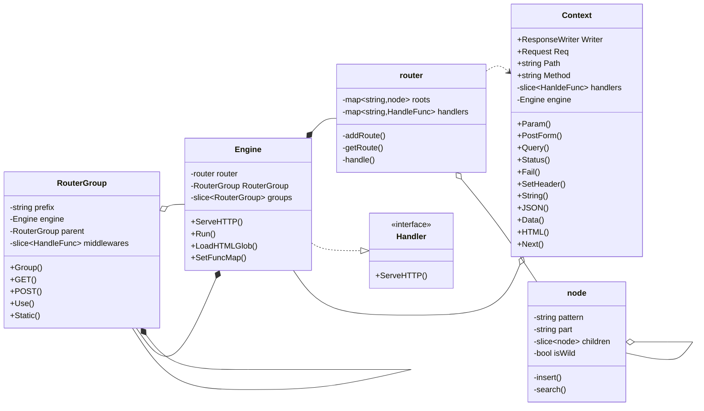

# Web 框架 - FexGo

> 参考 [7 days golang programs from scratch](https://github.com/geektutu/7days-golang)

## 特性

- 网络编程：基于 `net/http` 库的 HTTP 接口
- 请求上下文：使用 Context 封装 Request 和 Response，生命周期与请求一致，承载请求相关信息，对外提供简化接口
- 路由：支持动态路由，前缀树实现
- 路由分组：支持路由分组控制，支持分组嵌套，支持应用分组中间件
- 中间件
- 静态文件服务：基于 `http.FileServer`
- 服务端模板渲染：基于 `http/template` 库，支持普通变量/列表/对象渲染
- 错误恢复：提供中间件处理 panic

## 类图



## 示例

### 编译

```shell
cd example
go build -o fexgo
```

### 运行

```shell
cd example
go run .
```

## 使用多模块工作区进行开发

1. 在工作区目录下执行下面的命令，会创建 `go.work`文件
    ```
    go work init ./example
    ```

2. 在工作区中添加其他模块
    ```
    go work use ./fex
    ```

3. 通过此方法调用同一工作区下的其他模块。执行 example 模块：
    ```
    go run felixorb/example
    ```